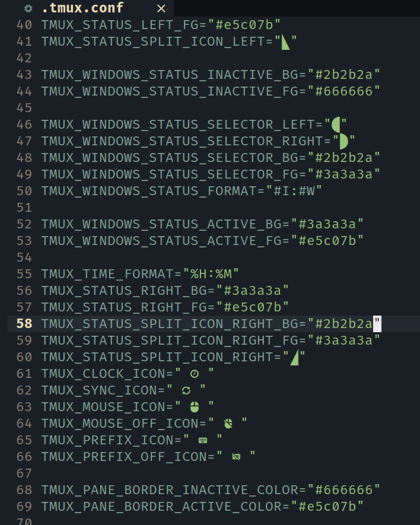

# tmux

https://user-images.githubusercontent.com/30021675/129849421-e7166224-3e46-42c9-8a61-567b99b3b772.mp4

## Install

First of all, you need a nerd font for full icon:
[nerd font](https://nerdfonts.com/) 

Then clone the repo and copy the config file to your home path.

```bash
git clone https://github.com/Avimitin/tmux
cp tmux/.tmux.conf ~/
```

## Keys

```text
* prefix:                <Ctrl-a>
* next window:           <Ctrl-Right>
* previous window:       <Ctrl-Left>
* move next:             <prefix>l
* move previous:         <prefix>h
* move up:               <prefix>k
* move down:             <prefix>j
* new session:           <prefix><Ctrl-c>
* split horizontal pane: <prefix>_
* split vertical pane:   <prefix>-
* toggle mouse:          <prefix>m
* copy mode:             <prefix>Enter
```

## Configure

Changed the icon and color you prefer here:

 

## Credit

Keymap is copied from
[gpakosz/.tmux](https://github.com/gpakosz/.tmux).

Some setting is copied from
[reorx/dotfiles](https://github.com/reorx/dotfiles/blob/master/tmux.conf).

Colorscheme is inspired by
[wfxr/tmux-power](https://github.com/wfxr/tmux-power).

## License

MIT License
